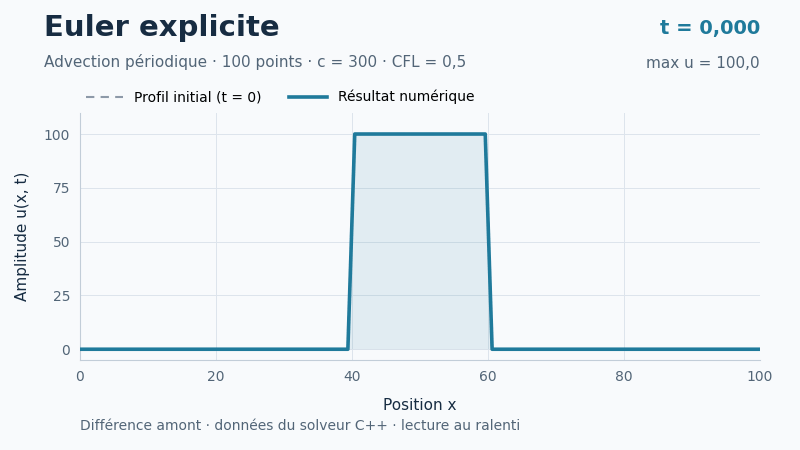
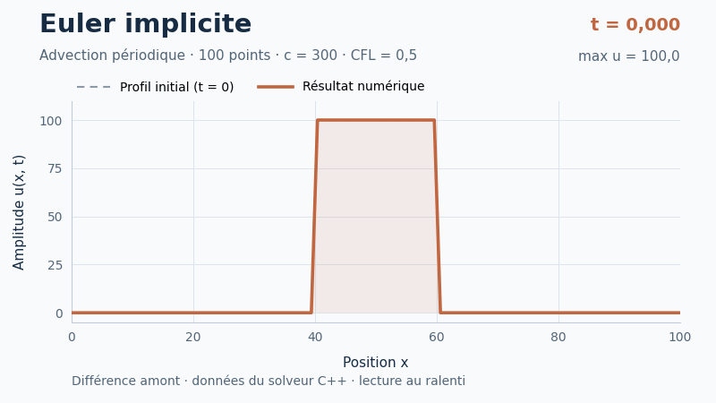

# WaveEquation

Projet pédagogique de simulation numérique 1D en C++, conçu pour apprendre à organiser un programme en modules, utiliser Eigen, construire le projet avec CMake et travailler en équipe avec Git.

Le cas étudié est le transport d'un profil initial par différences finies. Malgré le nom du dépôt, le modèle de référence actuel est **l'équation d'advection linéaire** :

$$
\frac{\partial u}{\partial t}+c\frac{\partial u}{\partial x}=0.
$$

L'exemple sert à explorer Euler explicite, Euler implicite, les conditions périodiques et la diffusion numérique. C'est un prototype d'apprentissage ; les limites actuelles sont précisées plus bas.

**Pour prendre le projet en main : [tutoriel CMake pour l'équipe](docs/TUTORIEL_CMAKE.md).** Les procédures couvrent [Windows](#démarrage-rapide-sous-windows), [macOS](docs/TUTORIEL_CMAKE.md#macos-avec-apple-clang-et-homebrew) et [Linux](docs/TUTORIEL_CMAKE.md#linux-avec-gcc-et-ninja).

## Résultats animés

Ces GIF proviennent de l'exécution du **solveur C++ du dépôt**, avec les mêmes paramètres pour les deux schémas : 100 points sur `[0, 100]`, `c = 300`, `CFL = 0,5` et un créneau initial d'amplitude 100. Les simulations sont calculées jusqu'à `t = 10` ; les animations montrent les 400 premiers pas, jusqu'à `t ≈ 0,6734`, au ralenti.

### Euler explicite



### Euler implicite



Les axes et les instants affichés sont identiques. La courbe grise en pointillés indique le **profil initial fixe**. Sur ce cas, l'implicite diffuse davantage le créneau : à la fin de la fenêtre affichée, le maximum vaut environ **43,7**, contre **68,2** pour l'explicite.

Le [guide des animations](docs/ANIMATIONS.md) explique comment relancer les deux calculs et régénérer les GIF sous Windows, macOS ou Linux. Python sert uniquement au tracé des CSV.

## Ce que contient le projet

- Un maillage uniforme 1D construit avec Eigen.
- Un profil initial en créneau, de valeur haute pour `40 < x < 60`.
- Deux modes : `Solve("E")` pour l'explicite et `Solve("I")` pour l'implicite.
- Des raccordements périodiques aux extrémités pour les différences avant et arrière.
- Une résolution QR avec Eigen dans le mode implicite.
- Des boucles de génération parallélisées avec OpenMP, lié à la cible `Solver`.
- L'affichage des résultats dans le terminal et leur export dans `results.csv`.

## Organisation

| Emplacement | Rôle |
|---|---|
| [Main/main.cpp](Main/main.cpp) | Paramètres de l'exemple, création du maillage, lancement et export. |
| [Mesh/](Mesh/) | Classe `MeshHandler` : génération et accès au maillage. |
| [Solver/](Solver/) | Classe de base `SolverHandler` et solveur `SolverWaveEquation`. |
| [NumMethods/](NumMethods/) | Profil initial, différences spatiales et sauvegarde CSV. |
| [CMakeLists.txt](CMakeLists.txt) | Dépendances, modules et cible exécutable `WaveEquation`. |
| [CMakePresets.json](CMakePresets.json) | Configuration partagée pour Visual Studio Build Tools 2026, en x64. |
| [examples/export_animations.cpp](examples/export_animations.cpp) | Export des deux schémas avec des paramètres communs, via la cible optionnelle `WaveEquationAnimations`. |
| [scripts/generate_gifs.py](scripts/generate_gifs.py) | Génération des GIF à partir des CSV exportés. |

Chaque module possède ses sources dans `src/`, ses en-têtes dans `include/` et son propre `CMakeLists.txt`.

## Démarrage rapide sous Windows

Installer Git, CMake **4.2 ou plus récent**, et Visual Studio Build Tools 2026 avec les outils C++ x64 et le Windows SDK. VS Code peut servir d'éditeur avec les extensions Microsoft **C/C++** et **CMake Tools**. Le générateur [Visual Studio 18 2026](https://cmake.org/cmake/help/latest/generator/Visual%20Studio%2018%202026.html) utilisé par le preset nécessite CMake 4.2 au minimum.

Eigen est recherché sur la machine ; s'il n'est pas trouvé, CMake récupère automatiquement la version **5.0.1** depuis son dépôt GitLab. Cette première configuration nécessite donc Git et un accès réseau. OpenMP est également recherché et requis par le projet.

Dans PowerShell :

```powershell
git clone https://github.com/arensaid2002-lab/WaveEquation.git
cd WaveEquation
cmake --preset MyPreset
cmake --build --preset MyPreset-debug --target WaveEquation --parallel
Push-Location .\out\build\MyPreset
.\Debug\WaveEquation.exe
Pop-Location
```

Avec ces commandes, le fichier de résultats se trouve dans `out/build/MyPreset/results.csv`. Une nouvelle exécution dans ce même dossier remplace ce fichier. Le programme affiche aussi la matrice dans le terminal.

Le tutoriel présente aussi les commandes pour [Visual Studio 2022 et Linux](docs/TUTORIEL_CMAKE.md#autres-environnements).

## Démarrage sous macOS

La [procédure macOS du tutoriel](docs/TUTORIEL_CMAKE.md#macos-avec-apple-clang-et-homebrew) guide l'installation des outils Apple, de Homebrew, de CMake, de Ninja et de `libomp`, puis la configuration, la compilation et l'exécution. Elle indique explicitement à CMake où trouver OpenMP avec Apple Clang ; les chemins sont obtenus depuis Homebrew pour s'adapter à son installation.

Sur Mac, suivre cette procédure dans Terminal ou dans le terminal intégré de VS Code. Le preset `MyPreset` fourni cible Visual Studio sous Windows.

## Modifier l'exemple

Les réglages se font actuellement dans [Main/main.cpp](Main/main.cpp), puis nécessitent une recompilation. Il n'y a pas encore d'interface de paramètres en ligne de commande.

| Paramètre | Valeur actuelle | Signification dans l'exemple |
|---|---|---|
| `nb_element` | `100` | Nombre de **points** du maillage, bornes incluses. |
| `x1`, `x2` | `0`, `100` | Bornes spatiales. |
| `c` | `300` | Paramètre de vitesse transmis au solveur. |
| `t` | `10` | Durée demandée ; voir la remarque sur les temps exportés ci-dessous. |
| `CFL` | `0.5` | Nombre de Courant transmis au solveur ; son signe choisit le sens spatial. |
| `max_u`, `min_u` | `100`, `0` | Valeurs haute et basse du créneau. |
| `Solve("E")` | Explicite | Remplacer par `Solve("I")` pour essayer l'implicite. |

L'emplacement du créneau est fixé dans [NumMethods/src/NumMethods.cpp](NumMethods/src/NumMethods.cpp). Si le domaine change, adapter aussi les bornes `40` et `60`.

Le solveur calcule maintenant `dt = abs(CFL_ * dx_ / c_)`, pour une vitesse non nulle. Les deux modes utilisent une différence spatiale **backward** lorsque `CFL > 0` et **forward** lorsque `CFL < 0`. Pour Euler explicite amont, choisir `0 < abs(CFL) <= 1`.

## Lire les résultats

`get_Results()` retourne une matrice de `N + 1` lignes, où `N` est le nombre de points spatiaux :

| Partie du CSV | Contenu |
|---|---|
| Première ligne | Les temps associés aux colonnes. |
| Lignes suivantes | Les valeurs de `u` aux points du maillage, dans leur ordre spatial. |
| Une colonne | Un état complet à un instant donné ; la première contient l'état initial. |

Le CSV n'a pas d'en-tête textuel, utilise la virgule comme séparateur et le point décimal. Les coordonnées spatiales ne sont pas exportées : elles proviennent du maillage. Le chemin `results.csv` est relatif au **dossier depuis lequel le programme est lancé**, pas nécessairement au dossier de l'exécutable. La visualisation des courbes se fait avec un outil externe.

## Points à connaître sur la version actuelle

- **Temps exportés.** Le nombre d'instants inclut maintenant l'état initial : `N_t = floor(t_ / dt) + 1`. La ligne des temps est répartie entre `0` et `t_` avec `LinSpaced`. Si `t_ / dt` n'est pas entier, son espacement `t_ / (N_t - 1)` diffère légèrement de `dt` ; en tenir compte pour les comparaisons temporelles précises.
- **Sens de propagation.** `c` et `CFL` sont saisis séparément. Pour respecter `CFL = c * dt / dx`, ils doivent avoir le même signe. Pour inverser la propagation, changer les signes de **ces deux paramètres** ; changer seulement `c` ne change pas le sens spatial choisi par le code.
- **Coût des calculs.** Le mode implicite construit désormais sa matrice une seule fois, puis recalcule sa factorisation QR à chaque pas. Tous les états sont conservés en mémoire. Commencer avec un petit maillage et mesurer en `Release` avant d'augmenter les tailles.

## Travail en équipe

Versionner les sources, les en-têtes, les fichiers CMake et la documentation. Les dossiers `build/`, `out/` et le fichier personnel `CMakeUserPresets.json` sont déjà ignorés par [.gitignore](.gitignore).

Chaque membre configure et compile sa propre copie. Un `git pull` récupère le code ; il ne reconstruit pas automatiquement l'exécutable. Le [tutoriel CMake](docs/TUTORIEL_CMAKE.md) décrit le cycle quotidien et les erreurs courantes.
